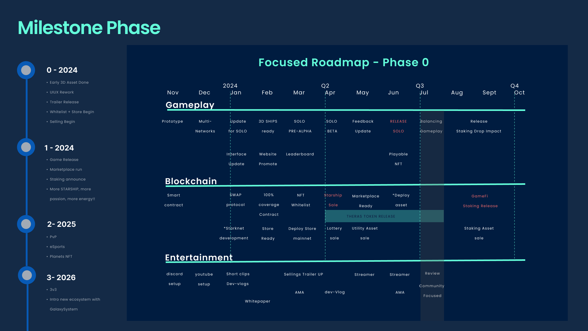

# Game Contracts README

## Overview

This repository contains the Cairo smart contracts for starknet development on our blockchain-based game, and my journey of learning cairo (yes, i just learnt since 3rd week of 2024 begin). These contracts facilitate the creation, management, and interaction with in-game assets, transactions, and special on-chain game features.

Apparently, some of implementations are still lacking on cairo-1 because some of feature i want only available on cairo-0 for example the EIP-712 equivalent here. [offchain-sign](https://community.starknet.io/t/signing-transactions-and-off-chain-messages/66/3) Thus migrating smart contracts from solidity isn't fully 100% success here, some of codes are still on experimenting and not merged to main branch yet

<!-- youtube -->

### 1 Min Starknet Update:

### 3 Mins Gameplay explained:

<!-- charts game mechanic -->

### Gameplay mechanics

 

### Smart Contracts

1. **GEMTOKEN or fUSD**

   - Address: `0x0701d53fb8a38869bc3fe28afb9d4100d30abe3b6fb8fa2cc7095edeca2bf386` (L2-erc20)
   - Description: Manages the game reward native token (GEMTOKEN or fake USD) following the erc-20 standard.

2. **EXPOINTS**

   - Address: `` (erc-20)
   - Description: Handles experience points (EXPOINTS) based on the erc20 standard.

3. **NFTASSET**

   - Address: `` (ERC-1155)
   - Description: Manages non-fungible assets (NFTASSET) with unique identifiers following the ERC-1155 standard.

4. **NFTSTARSHIP**

   - Address: `` (ERC-1155)
   - Description: Manages non-fungible starships (NFTSTARSHIP) following the ERC-1155 standard.

5. **NFTPASS**

   - Address: `0x048d1f460c9aa44e2a2cd4d49982b41e8ba10174f966c227b213aed77814808d` (L2-ERC-721)
   - Description: Manages non-fungible passes (NFTPASS) following the ERC-721standard.

6. **NFTTICKET**

   - Address: `` (ERC-721)
   - Description: Manages non-fungible tickets (NFTTICKET) following the ERC-721 standard.

7. **MANAGERCLAIM**

   - Address: ``
   - Description: Handles backend data management and securely mints NFTs to respective contracts. Allows users to claim NFTs through frontend using EIP712 signatures.

8. **EXPLOREPLAY**

   - Address: ``
   - Description: Handles the locking of ticket-NFTs when entering restricted dimensions and manages the drop material interval. Will be extended using selective materials and tier from MaterialsRegistryContract

9. **SHOP**

   - Address: ``
   - Description: Manages in-game shop logic, requiring correct token payments for products listed in the shop storage.

10. **ATOMIC SWAP**

- Address: `0x`
- Description: SWAP token standard to the STAREX universal cross-chain token from backend using eip-712
  // currently not deployed due to sync with backend and progress only intended to show for Injective network and not cross-chain demo

## Manager Claim

The Manager Claim contract is designed for interaction between OFFCHAIN and ONCHAIN security for rewards distribution. When players acquire NFTs during gameplay, the data is being recorded in the backend. The backend provides a signature for users to claim their pending NFTs through the frontend using EIP712. The Manager Claim contract securely mints these NFTs to the respective contracts.

## Shop Contract

Similar to the Manager Claim, the Shop contract manages backend data but requires correct token payments for products listed in the shop storage. Users can purchase in-game items by interacting with this contract.

## Explore-Play Contract

Users lock (changing to burning now instead) their ticket-NFTs based on their rarity will enter other dimensions within the game. This contract governs the logic for this process.

## Season Pass

The Season Pass contract is similar to a subscription, providing a time-limited soulbond token. It operates similarly to the points-token (ERC-721), which can be earned through gameplay or purchased from the store. These points can later be used to acquire items in the shop.

## Future Integrations

Additional contracts will be introduced as the game progresses into early beta around Q2 2024.
Adding more complexity for now is not our current goal as we are focusing on our first selling and simply just need a simple approach then later can progressively develop more contracts to integrate.

Hence this is our next development for blockchain, started between Q2-Q3 this year 2024, which includes:

- Peripheral Materials Registry Contracts
- Crafting contract with VRF
- Marketplace contract - (for user to find materials and trade)
- Staking NFT Expedition Contract
- Staking Asset Contract
- TBC

<!-- FIXED ROADMAP -->

## Roadmap

